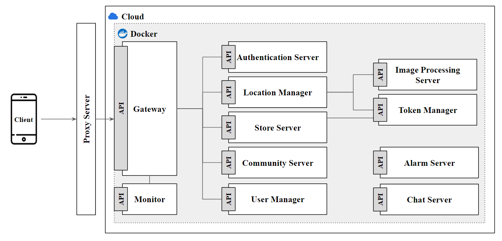

# Capstone Design Project / Anywhere Map
This repository is the meta repository for AWM v2.

## 0. Introduction
This is a map where anyone can register and verify locations.   
Unlike traditional centrally managed maps, this map uses user-based algorithms, allowing everyone to contribute easily.   
Each location features a community and real-time chat function, enabling users to get detailed information or engage in discussions.   
Additionally, it offers extra features like weather information and user clustering.   
Demo video: [LINK](https://www.youtube.com/watch?v=ja8XFNCLJ1U)

## 1. Getting Started
Start with the following command:
```
bash auto_start_awm-v2.sh
```
If there are permission issues, add the 'sudo' keyword.

If you want to remove all running services, use the following command:
```
bash clear.sh
```
Similarly, if there are permission issues, add the 'sudo' keyword.

## 2. AWM v2 Major Updates
AWM v2 is an upgraded version of AWM v1 with the following major changes:
* Adopted MSA architecture:
  * Provides scalability and high fault tolerance.
* Added reverse proxy server:
  * Protects the server.
* Added load balancer:
  * Enhances server security.
* Introduced incentives:
  * Increases user participation.
* Added a store where incentives can be used:
  * Provides a platform for users to utilize their incentives.
* Added a verification system for registered location information:
  * Ensures the accuracy and reliability of location data.
* Added a navigation system for location information:
  * Facilitates user navigation to specific locations.
* Image processing:
  * Empowering your business with intelligent image processing and analysis.
* Real-time Alert Function:
  * Connects one-on-one with users to send real-time alerts.

## 3. Repository Classification
|Repository|Description|URL|
|:---|:---|:---|
|awm-v2-gateway|Serves as the initial point of contact for clients.|[link](https://github.com/ahr-i/awm-v2-gateway)|
|awm-v2-authentication-server|Handles client authentication and issues or validates JWT tokens.|[link](https://github.com/ahr-i/awm-v2-authentication-server)|
|awm-v2-location-manager|Provides functions for querying, registering, and modifying information about places.|[link](https://github.com/ahr-i/awm-v2-location-manager)|
|awm-v2-image-processing-server|We offer image processing services, including image-based location search.|[link](https://github.com/ahr-i/awm-v2-image-processing-server)|
|awm-v2-community-server|Offers a community where users can write, view, and modify posts.|[link](https://github.com/ahr-i/awm-v2-community-server)|
|awm-v2-chat-server|Provides real-time messaging functionality between users.|[link](https://github.com/ahr-i/awm-v2-chat-server)|
|awm-v2-store-server|Handles the registration of items sold in the store and the processing of purchases.|[link](https://github.com/ahr-i/awm-v2-store-server)|
|awm-v2-user-manager|Performs functions related to the user, such as user profile and friend search features.|[link](https://github.com/ahr-i/awm-v2-user-manager)|
|awm-v2-alarm-server|Responsible for sending real-time alerts to users.|[link](https://github.com/ahr-i/awm-v2-alarm-server)|
|awm-v2-monitor|Allows you to monitor the status of the entire system.|[link](https://github.com/ahr-i/awm-v2-monitor)|
|awm-v1-backend|This is version 1 of the AWM. It is implemented using a monolithic architecture.|[link](https://github.com/ahr-i/awm-v1-backend)|

## 4. Project Infomation
|Category|Project ID|Project Name|Disclosure Scope|
|:---:|:---:|:---:|:---:|
|Capstone Design Project|#2|Anywhere Map|Public|

### 4.1 Architecture


## 5. Project Brief

### 5.1 Purpose
1. Provide users with the location information of necessary facilities.
2. Display location information not shown on standard maps.
3. Real-time location information updates through user communication.

### 5.2 Expected Effect
1. Not only does it show essential location information, but users can also know location information that couldn't be known with existing maps through a place sharing feature among users.
2. With the map containing a vast amount of data, users can filter and view only the necessary information using the custom feature for their convenience.
3. By allowing users to directly modify information about a specific facility, information about the place is updated in real-time.

### 5.3 Core Target
1. Users in their 10s to 40s

### 5.4 Format
1. Mobile Application

### 5.5 Condition
1. Design of the program and cloud DB.
2. Set up a test environment for testing.
3. In screen configuration, the settings and customer center should be kept to 4 depths or less.
4. Excluding the settings and customer center in screen configuration, other screens should be kept to 3 depths or less.

### 5.6 Function
* Place Sharing Feature
  * Real-time sharing of information about places among users.
  * Ability to provide additional explanations about places using photos.
* User Community
  * Features for users to reply to and recommend each other's comments.
* Map Functionality
  * Keyword filtering and customization features.
  * Navigation-based route guidance system.
* Place Information Database (DB)
  * Search for information about places and user reviews.
* Foreign Language Support
* Various Search Functions Beyond Text
  * Voice recognition function.
* Place Visibility Setting Function
  * A feature that allows only the user to view personal places.
* User Management System
  * Manage malicious users through a reporting function.
  * User-to-user reporting and blocking features.
* Map Interface
  * Display of distance, route, and time.
  * Display of nearby facilities.

## 6 Document
<a href="https://docs.google.com/spreadsheets/d/1nEh904hfjWP3kfXu41WGr4Z9NcRg2JVtGt0FnFGhD2U/edit#gid=0" target="_blank">
  
</a>
<a href="https://docs.google.com/spreadsheets/d/1_wGeAE6OmdCe5b821GUyuTooV0xRWut6cA69srGbYf0/edit#gid=0" target="_blank">
  
</a>
<a href="https://www.figma.com/file/3eOsg53BKqmMiH1lCBfjLY/Romantic-Map?type=design&node-id=0%3A1&mode=design&t=JUGS0GNPDJYG7kQl-1" target="_blank">
  
</a>
